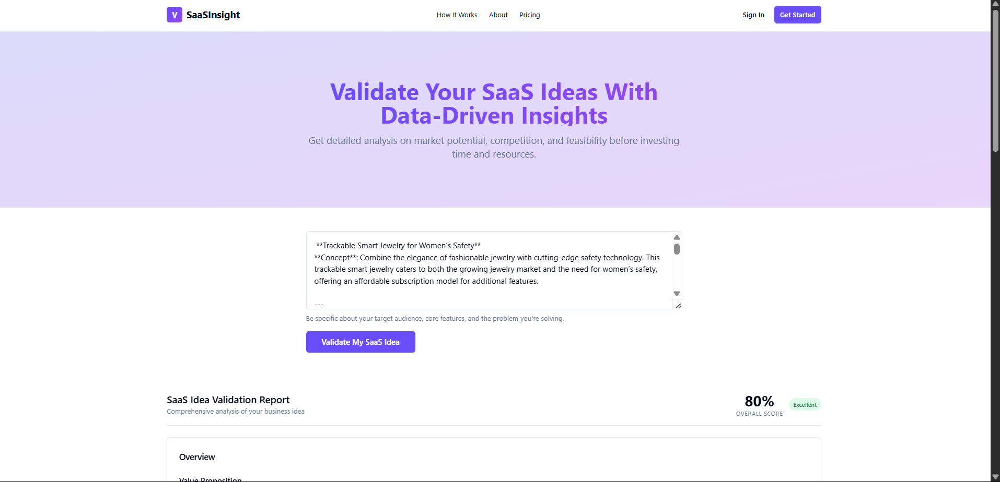
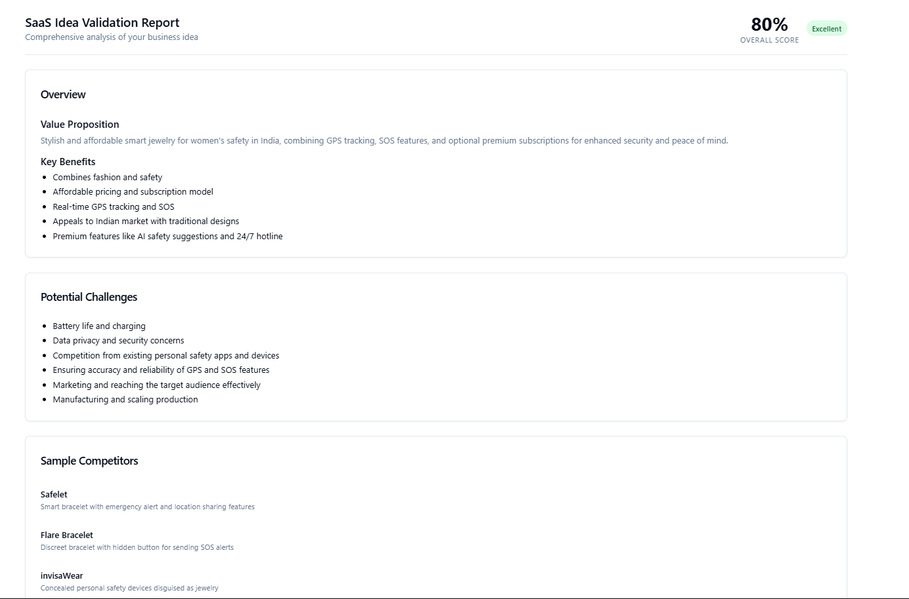
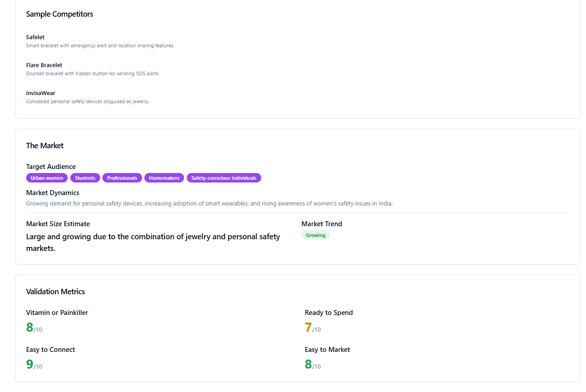
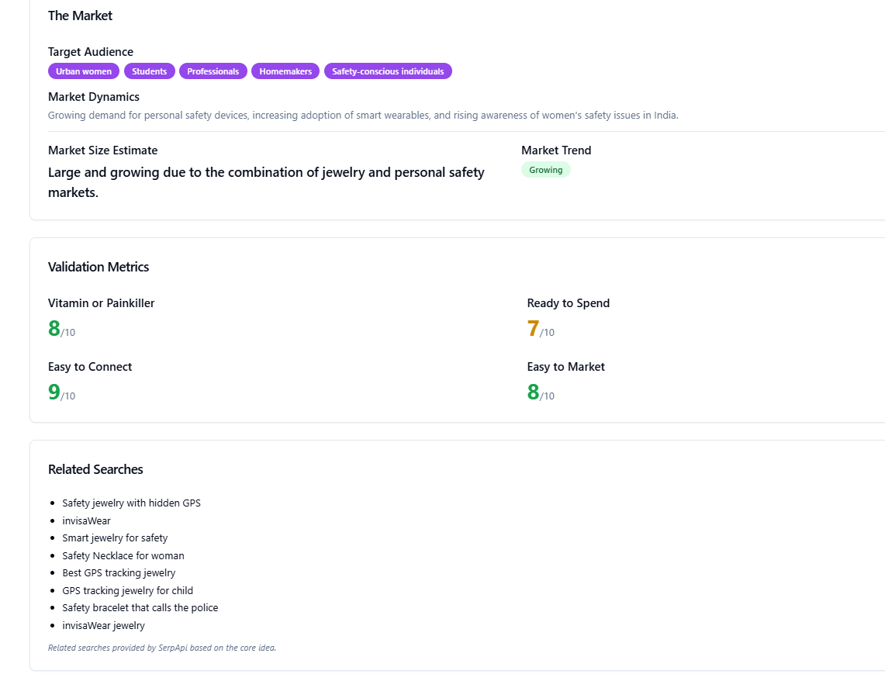

# SaaSInsight - AI-Powered SaaS Idea Validator

SaaSInsight is a web application designed to provide quick, data-driven validation for new Software-as-a-Service (SaaS) ideas. Users can input a description of their SaaS concept, and the tool leverages AI and search data to generate a comprehensive report covering market potential, competition, feasibility, and related search trends.

**[Link to Live Demo]**(YOUR_LOVABLE_APP_URL_HERE) 
**(Note:** This live demo uses free API tiers and may be rate-limited, especially the AI analysis. If you encounter an error, please wait ~60 seconds and try again, or view the video demo below!)**

**[Link to Video Demo]**(YOUR_YOUTUBE/VIMEO_VIDEO_LINK_HERE) 

https://vimeo.com/1079023082?share=copy#t=0

![Screenshot of SaaSInsight Report] 

## Problem Solved

Validating a SaaS idea before investing significant time and resources is crucial but often time-consuming. Traditional market research can be expensive and slow. SaaSInsight aims to provide founders, product managers, and indie hackers with rapid, automated initial feedback on their ideas.

## Features

*   **AI-Powered Analysis:** Uses Google Gemini (via API) to analyze the user's idea description and generate insights on:
    *   Value Proposition & Key Benefits
    *   Potential Challenges (Risks & Weaknesses)
    *   Sample Competitors
    *   Market Analysis (Target Audience, Dynamics, Size Estimate, Trend)
    *   Key Validation Metrics (Vitamin/Painkiller, Readiness to Spend, etc.)
    *   Overall Score Estimate
*   **SEO Insights:** Integrates with SerpApi to provide a list of related search terms, giving context on user search behavior around the idea.
*   **Structured Report:** Presents the generated insights in a clear, easy-to-read card-based format.
*   **Serverless Backend:** Utilizes Supabase Edge Functions for scalable, efficient backend processing.

## Tech Stack

*   **Frontend:** React, TypeScript, Tailwind CSS (Likely bundled by Lovable.ai)
*   **Backend:** Supabase Edge Functions (Deno, TypeScript)
*   **AI Analysis:** Google Gemini API (specifically `gemini-1.5-pro-latest`)
*   **SEO Data:** SerpApi (Google Search API)
*   **Deployment/Hosting:**
    *   Frontend: Lovable.ai (connected via GitHub)
    *   Backend: Supabase

## How It Works

1.  User enters their SaaS idea description into the form on the frontend.
2.  The frontend makes a `POST` request to the `validate-idea` Supabase Edge Function.
3.  The Edge Function:
    *   Parses the `ideaDescription`.
    *   Retrieves `GEMINI_API_KEY` and `SERPAPI_API_KEY` from Supabase Secrets.
    *   Constructs a detailed prompt for Gemini, including the user's idea and the desired JSON output structure.
    *   Calls the Gemini API.
    *   Cleans and parses the JSON response string from Gemini.
    *   Constructs a search query based on the idea.
    *   Calls the SerpApi.
    *   Extracts related searches from the SerpApi response.
    *   Combines the Gemini analysis and SerpApi data into a single JSON object.
    *   Returns the combined JSON object to the frontend.
4.  The frontend receives the JSON data and uses the `ValidationReport` React component to dynamically render the structured report on the page.

## Setup & Running Locally (Optional - For Developers)

*(Briefly mention the steps if someone wanted to run your code)*

1.  **Clone the repository:** `git clone https://github.com/Priyanshu-chippa/saas-idea-insights.git`
2.  **Install dependencies:** `npm install` (or `yarn install` / `pnpm install`)
3.  **Supabase Setup:**
    *   Create a Supabase project.
    *   Enable Edge Functions.
    *   Create the `validate-idea` function using the code from `supabase/functions/validate-idea/index.ts` (or link the local repo).
    *   Add `GEMINI_API_KEY` and `SERPAPI_API_KEY` to Supabase Project Secrets.
4.  **Frontend Environment Variables:** Create a `.env` file for the frontend with:
    - `VITE_SUPABASE_URL=...`
    - `VITE_SUPABASE_ANON_KEY=...`
    - `VITE_FUNCTIONS_URL=...` (optional; defaults to `${VITE_SUPABASE_URL}/functions/v1`)
5.  **API Keys:** Obtain your own API keys from Google AI Studio and SerpApi.
6.  **Run Frontend:** `npm run dev` (or equivalent command).
7.  **Deploy Backend:** Use the Supabase CLI to deploy the function: `npx supabase functions deploy validate-idea --no-verify-jwt` (ensure Docker Desktop is running). Set the project via `supabase link --project-ref <your-new-project-ref>`.

## Challenges & Future Improvements

*   **API Rate Limits:** The free tiers for Gemini and SerpApi have strict rate limits (especially Gemini's requests-per-minute limit) which can cause errors during heavy use.
*   **LLM Output Variability:** Gemini's output format isn't always perfectly consistent JSON, requiring robust cleaning on the backend. Generated content quality can vary.
*   **Frontend Rendering:** Ensuring the frontend component correctly matches the backend data structure requires careful state management and prop handling in React.
*   **Future:** Implement user authentication (Supabase Auth), save reports, add more data sources, refine prompts, improve UI/UX, implement frontend rate limiting/debouncing.

## Acknowledgements

*   Built using Lovable.ai(just the frontend UI), Supabase, Google Gemini, and SerpApi.
*   UI components potentially from shadcn/ui (check `components.json`). 